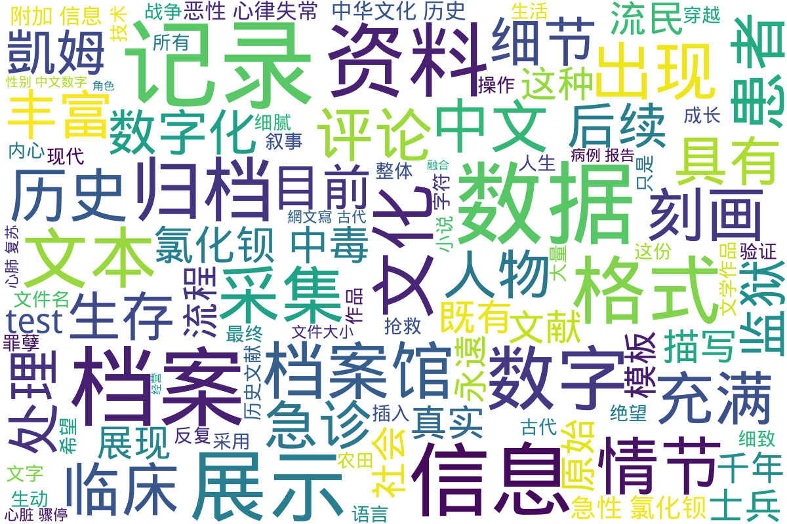

---
search:
  exclude: true
---

# 测试

!!! info

    该目录位于路径“./测试”下，主要包含一个名为“测试.txt”的文档。从文档内容来看，文件较为简短，仅仅包含了连续重复的字符“hhhh”。表面上看，该文件似乎只是用于数字档案馆内部的测试和格式校验，但深入分析后可以发现，这种单一字符重复的现象很可能是数字采集和数据整理过程中初步录入步骤的一个示例。
    
    文中详细描述了该文档在档案管理中的应用，暗示其作用可能包括占位符使用、暂存数据的留痕、防止检索空档或作为系统自校验的默认记录。通过对该文件研究，可以窥见数字化初期采集过程中严格的数据管理流程，反映出档案整理者对原始资料精确定录入与保存的一种态度。该文档虽然内容简略，但它在数字档案管理中体现了对数据一致性与完整性的追求。
    
    整体来看，该目录展示的是一个测试阶段的样本文档，除了承载简单测试数据外，还揭示了档案管理过程中对每个文件细致考察的工作细节，以及在采集、整理、归档过程中的常规数据格式示例。由此可以看出，这不仅是文化与历史资料数字化工作中的一部分，同时也反映出数字档案馆对每个资料细节的关注和记录。

!!! note "📊 统计信息"

    总计内容：6 篇
    标签：`测试` `占位符` `数字档案` `数据采集` `文档管理` `初步录入`

### 📄 文档

<table>
<thead><tr>
<th style="width: 40%" data-sortable="true" data-sort-direction="asc" data-sort-type="text">标题 ▲</th>
<th style="width: 15%" data-sortable="true" data-sort-direction="desc" data-sort-type="year">年份 ▼</th>
<th style="width: 45%">摘要</th>
</tr></thead>
<tbody>
<tr data-name="急性氯化钡中毒致恶性心律失常、反复心脏骤停一例" data-year="2021" data-date="2025-02-26">
                <td><a href="急性氯化钡中毒致恶性心律失常、反复心脏骤停一例_page" class="md-button">急性氯化钡中毒致恶性心律失常、反复心脏骤停一例</a></td>
                <td class="year-cell">2021</td>
                <td class="description-cell">

                    
展开

                    

                        本文件是一份来自中华急诊医学杂志的病例报告，内容详细记载了一例因急性氯化钡中毒引发的恶性心律失常和反复心脏骤停的临床案例。文中通过详尽病史记录和抢救过程的文字描述，展现了患者在口服200克氯化钡粉末后出现严重中毒症状，包括意识模糊、全身大量出汗、呕吐、低钾血症以及明显的心率异常等。患者在入院后经过胃洗、大量补液、心肺监护及连续心肺复苏等多种紧急措施进行处理，过程中多次出现呼吸心搏骤停，心电图显示室性心动过速、室颤及T波倒置等典型变化。文本内容中包含丰富的具体数据，例如心率达到120次/分钟、血压154/120 mmHg、血钾最低仅1.7 mmol/L、乳酸最高达11.4 mmol/L，以及多次心肺复苏相关的时间节点和操作记录，使得整个抢救过程和病情进展显得真实生动。文中还引用了多篇国外和国内文献作为背景资料，这些文献的标准化引用和DOI号为论文增加了科学依据，也体现了现代医学诊疗中对急诊超声及心脏影像监测等技术应用的重视。临床记录描述了患者入院后从洗胃、心电监护、静脉补钾到最终心肺复苏失败的全过程，同时也讲述了由于低钾症导致细胞膜钾通道受抑制，引起多系统功能衰竭的病理机制。文章还特别说明了氯化钡中毒的毒理机制：钡离子通过激活Na+-K+-ATP酶，并竞争性抑制细胞膜上钾通道，造成细胞外钾持续性下降，进而导致肌肉麻痹、呼吸衰竭及恶性心律失常。此病例报告通过对1例急性氯化钡中毒患者的详细总结，不仅展示了临床上救治急危重症患者的复杂过程，也为临床救治提供了宝贵的实证经验，其详细的数据记录和复苏操作步骤为今后类似急诊处理提供了可参考的实践案例。该文档文字内容丰富，记录详实，既有具体的抢救时间节点和操作方法，也描述了患者从中毒、诊断、治疗到最终临床死亡的全过程，让人对急诊医学中的疑难病例处置有更深入的认识。
                         年份：2021
                         收录日期：2025-02-26
                    

                
</td>
            </tr>
<tr data-name="测试" data-year="None" data-date="2024-11-15">
                <td><a href="测试_page" class="md-button">测试</a></td>
                <td class="year-cell">None</td>
                <td class="description-cell">

                    
展开

                    

                        该文档位于路径“./测试/测试.txt”，内容较为简短，但仍具有一定的研究价值和考察意义。文档中仅包含了简单的字符“hhhh”，表面上看似无特定含义，但仔细分析则可以发现，这种单一字符的重复可能代表了一种测试阶段的占位符、格式校验或是数字档案馆内部文档的记录痕迹。文本的简洁性使得人们联想到在数字化采集和数据整理过程中可能出现的暂存数据或样本文档，因此，通过这份文件，我们可以窥见资料采集初期的状态，以及在整理、归档过程中可能存在的简单记录。尽管内容极为简略，但文中所显示的“hhhh”也许暗示着一种语言符号的初步录入步骤，或是系统在测试时生成的默认占位符。文中的字符组合虽然稀疏，但可以结合文件的路径和文件所属的类型——文档，推测该文件可能起初只是用于流程检测，并未经过进一步编辑整理。通过对该文件的研究，我们不仅能感受到数字化文献管理的严格性，还能体会到在实际采集中文化资料时，哪怕是最简单的信息也会被保留下来，以供后续整理和参考。从内容来看，文本虽然仅有单一重复短语，但这种简单的表现形式反映了在一定时期或阶段中，人们对数据格式的一个初步探索和尝试。该文件的存在给我们提供了一个观察数据采集与管理过程的窗口，能让研究者思考数字档案工作中那些常常被忽略的细节。这种看似微不足道的文本实际上可能蕴含着档案馆工作人员在处理大量文献时所采取的一种标准化措施，确保每个文件都有基本的信息记录。借由这份内容简单却不失严谨的文档，可以看出档案整理者对原始资料的尊重和对数据一致性的追求。通过对这样一份文件的考察，我们可以联想到在数字化操作中一些常规的数据格式示例以及系统自校验的细节，这也从侧面反映出现代数字档案管理中对原始数据精确保留的态度和精神。
                         年份：None
                         收录日期：2024-11-15
                    

                
</td>
            </tr>
<tr data-name="網文寫手古代生存錄_令狐BEYOND" data-year="None" data-date="2025-02-26">
                <td><a href="網文寫手古代生存錄_令狐BEYOND_page" class="md-button">網文寫手古代生存錄_令狐BEYOND</a></td>
                <td class="year-cell">None</td>
                <td class="description-cell">

                    
展开

                    

                        该文件是一份内容丰富的中文资料，内容分为两大部分。第一部分是关于小说《網文寫手古代生存錄》的详细评论与分析。文中详细介绍了小说的总体评价、情节架构、角色塑造、细节描写、文笔与叙事方式以及市场潜力。文中提到，这部小说融合了穿越、经营、种田以及历史奇幻等多种元素，刻画了一位现代网文写手穿越到古代，从乞丐到登基为帝的完整成长历程。作者在评论中不仅详述了主角池非（苏真）的性格特点和成长轨迹，而且对配角如劉掌櫃、顧三友、鄧全等人物的刻画也给予了充分的评价。同时，对作品中关于古代户籍制度、会计体系、话本市场以及商业经营的细节描写给予了高度肯定，并针对部分情节的节奏与角色转变提出了改进建议。评论内容穿插了具体的情节描述，如“如何進城？如何辦戶籍？如何應聘帳房？如何創作話本？”等问题的探讨，使评论既具有理论深度，又不失文学的趣味性。评论的语言生动，文字流畅，既有对情节细腻的描述，也有对市场开发潜力的分析，为该作品的改编提供了参考意见。

第二部分则是一篇以“001新來報導”为标题的历史叙事文，描述了大魏靖安二十三年期间的一系列灾难与战事。文中详细刻画了北方大旱、胡人入侵、流民迁徙以及京城防控灾民的情形。描述中提到，由于大旱与战乱，北方数十万灾民为避战火只能南迁，而京师则严阵以待，采取分区安置与施粥措施以防止瘟疫与暴乱。同时，朝廷调集三十万大军驱逐入侵的胡人，虽然战事最终取得胜利，但士兵伤亡惨重，被形容为“慘勝”。文中还描写了流民中的个体命运，一段关于两个青年流民对待一名仅有十一、二岁孩童的残酷讨论与实际暴行，以及随后县里野狗围绕尸体的惊险情节。场面刻画真实而细腻，涉及人与自然、灾难与生存的碰撞，描写中不乏对人物心理与环境变化的细致描述，如“他用眼睛掃視著四周尋找可以當武器的東西”，以及对主角苏真内心挣扎和对未来可能的报仇计划的暗示。这两部分内容既反映了现代文学评论的深刻见解，也展现了古代社会动荡与人物命运的生动刻画，是一份融合了文艺评论和历史叙事的综合性资料。

整体来说，该文件不仅详细记录了《網文寫手古代生存錄》的创作与艺术特色，也再现了特定历史情境下的民生疾苦和社会现象，具有较高的文化价值和多元化的视角。
                         年份：None
                         收录日期：2025-02-26
                    

                
</td>
            </tr>
</tbody>
</table>

## 📁 子目录

<table>
<thead><tr>
<th style="width: 30%" data-sortable="true" data-sort-direction="asc" data-sort-type="text">目录名 ▲</th>
<th style="width: 20%" data-sortable="true" data-sort-direction="asc" data-sort-type="text">文件数量 ▲</th>
<th style="width: 50%">简介</th>
</tr></thead>
<tbody>
<tr data-name="testdir" data-count="3" data-date="0000-00-00">
                <td><a href="testdir" class="md-button">testdir</a></td>
                <td class="count-cell">3 篇</td>
                <td class="description-cell">

                    
展开

                    

                        本目录包含两个主要部分的内容。第一部分为测试文件，用于验证中文数字档案系统的基本功能与结构。该测试文件采用 Markdown 格式，内容中反复出现“测试”二字，并展示了从一级标题到三级标题的层次结构。文档中详细记录了文件的归档信息、元数据及附加说明，例如文件名、文件大小、归档日期、原始链接、作者等信息，并以表格形式呈现部分属性。该部分内容不仅展示了系统如何统一格式、捕捉重复关键词及自动插入说明，同时体现了对历史文献、文学作品、社会文化、数据统计与民间故事等多种档案类型的整体收录要求。

第二部分是一部叙事性文学作品，其标题为“失落的奧德賽_千年之夢_永遠的旅人_永遠を旅する者_ロストオデッセイ_千年の夢_重松_清”。作品通过主人公在监狱中体验孤独抗争和对自由的渴望，展开了一段充满绝望与希望、罪恶与救赎并存的生命旅程。文中描述了从监狱到酒馆，再到平静农田的多重场景，通过细致的笔触描述人物内心的挣扎与自我救赎。作品中不仅以“他不會老，只是離開而已；他不會死，只是分別而已”的哲理语句令人深思，同时也展示了多种文化和语言（如中文、日语等）的交融，反映出跨文化艺术表达的独特风貌。

整体来看，该目录展示了数字档案系统在文档格式、元数据详细记录和内容多样性方面的示范性应用，同时也体现了中华文化与历史资料在数字化存储、整理及展示中的具体要求与技术规范。
                         文件数量：3 篇
                    

                
</td>
            </tr>
</tbody>
</table>

## 📊 词云图 { data-search-exclude }

 

=== "最多访问"

!!! note "自动生成说明"
    目录及摘要为自动生成，仅供索引和参考，请修改 .github/ 目录下的对应脚本、模板或对应文件以更正。
