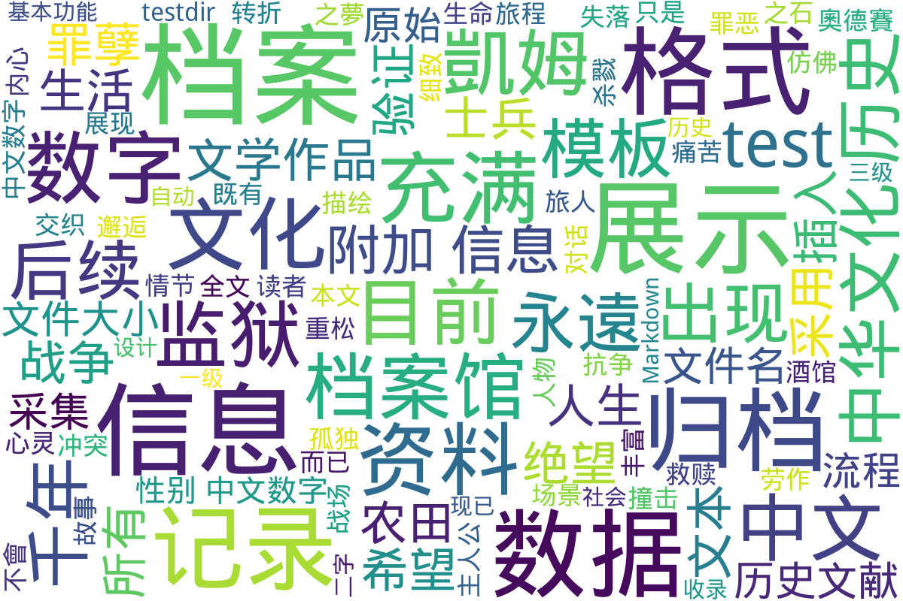

---
search:
  exclude: true
---

# testdir

!!! info

    本目录包含两个主要部分的内容。第一部分为测试文件，用于验证中文数字档案系统的基本功能与结构。该测试文件采用 Markdown 格式，内容中反复出现“测试”二字，并展示了从一级标题到三级标题的层次结构。文档中详细记录了文件的归档信息、元数据及附加说明，例如文件名、文件大小、归档日期、原始链接、作者等信息，并以表格形式呈现部分属性。该部分内容不仅展示了系统如何统一格式、捕捉重复关键词及自动插入说明，同时体现了对历史文献、文学作品、社会文化、数据统计与民间故事等多种档案类型的整体收录要求。
    
    第二部分是一部叙事性文学作品，其标题为“失落的奧德賽_千年之夢_永遠的旅人_永遠を旅する者_ロストオデッセイ_千年の夢_重松_清”。作品通过主人公在监狱中体验孤独抗争和对自由的渴望，展开了一段充满绝望与希望、罪恶与救赎并存的生命旅程。文中描述了从监狱到酒馆，再到平静农田的多重场景，通过细致的笔触描述人物内心的挣扎与自我救赎。作品中不仅以“他不會老，只是離開而已；他不會死，只是分別而已”的哲理语句令人深思，同时也展示了多种文化和语言（如中文、日语等）的交融，反映出跨文化艺术表达的独特风貌。
    
    整体来看，该目录展示了数字档案系统在文档格式、元数据详细记录和内容多样性方面的示范性应用，同时也体现了中华文化与历史资料在数字化存储、整理及展示中的具体要求与技术规范。

!!! note "📊 统计信息"

    总计内容：3 篇
    标签：`测试文件` `数字档案` `文档结构` `元数据` `历史文献` `文学作品` `跨文化` `中华文化` `系统验证` `艺术创作`

### 📄 文档

<table>
<thead><tr>
<th style="width: 40%" data-sortable="true" data-sort-direction="asc" data-sort-type="text">标题 ▲</th>
<th style="width: 15%" data-sortable="true" data-sort-direction="desc" data-sort-type="year">年份 ▼</th>
<th style="width: 45%">摘要</th>
</tr></thead>
<tbody>
<tr data-name="失落的奧德賽_千年之夢_永遠的旅人_永遠を旅する者_ロストオデッセイ_千年の夢_重松_清" data-year="None" data-date="2025-02-26">
                <td><a href="失落的奧德賽_千年之夢_永遠的旅人_永遠を旅する者_ロストオデッセイ_千年の夢_重松_清_page" class="md-button">失落的奧德賽_千年之夢_永遠的旅人_永遠を旅する者_ロストオデッセイ_千年の夢_重松_清</a></td>
                <td class="year-cell">None</td>
                <td class="description-cell">

                    
展开

                    

                        本文是一部文风独特的叙事性文学作品，全文通过主人公凱姆在监狱中的孤独抗争以及与其他人物之间的邂逅，描绘了一个充满绝望与希望、罪恶与救赎冲突交织的人生旅程。文中开篇以“失落的奧德賽 千年之夢 永遠的旅人 永遠を旅する者 ロストオデッセイ 千年の夢 重松 清”等文字点题，显示出不同语言和文化元素的交融。故事一开始便将读者带入那个充满压抑与痛苦的监狱，主人公被编号为“８号”，在严苛的铁栏杆与冷漠的看守之间不断地撞击身体与心灵。在这种近乎机械般重复的抗争中，他虽然知道自己的努力可能毫无结果，但内心深处那股不停翻滚的冲动和对自由的渴望却始终未曾熄灭。作者用细腻的笔触描绘了他撞击铁门时所感受到的钝痛，以及在囚禁环境下时间如何变得麻木而缓慢的过程，展现出一种对时间流逝的独到感受，仿佛生命在重复的动作中定格，又在细微处孕育着改变的契机。

情节的另一转折带领读者走进了喧闹但又充满悲情的酒馆场景。在这里，凱姆与一名经历了残酷战争的现役士兵邂逅，对方在备受内心煎熬的同时，也流露出对家人的思念和对未来归途的无限恐惧。士兵手中那块被称为“罪孽之石”的宝石原石，随着每一次杀戮逐渐黯淡无光，成为他内心罪恶与绝望的象征，而这件物品的变化清晰地映射出他心理的变化。两人短暂而意味深长的对话中，既有对战争罪孽的深沉自责，也有对生存本能的无奈认命，凱姆那句“他不會老，只是離開而已；他不會死，只是分別而已”，更是令人深思的生命哲理的体现。士兵对归家的期盼与对自己杀戮行为的谴责交织在一起，使整个场景充满了悲剧色彩和人性反思的浓重气息。

而在故事的后半部分，情节再次发生转折，凱姆走出酒馆进入平静而劳作的农田。稻谷与蔬菜的生长、晚钟的响起和送葬队伍的到来，构成了一幅静谧而又充满隐喻的画面，象征着在经历了无尽的痛苦与纷争后，寻求平凡生活的可能。面对大嬸热情且充满人情味的邀请，凱姆仿佛在漫长的旅途中获得了一丝久违的温暖与希望，从监狱的束缚到农田的劳作，文本以细致的写实手法表现出人在绝境中对新生活的期许与向往。整部作品用丰富的细节与对话，刻画了人物内心世界的挣扎和成长，展现了一幅由监狱到战场再到农田的人生缩影，既有激烈的冲突与自我对抗，也有平和的沉思与生活的温情。
                         年份：None
                         收录日期：2025-02-26
                    

                
</td>
            </tr>
</tbody>
</table>

### 🖼️ 图片

<table>
<thead><tr>
<th style="width: 40%" data-sortable="true" data-sort-direction="asc" data-sort-type="text">标题 ▲</th>
<th style="width: 15%" data-sortable="true" data-sort-direction="desc" data-sort-type="year">年份 ▼</th>
<th style="width: 45%">摘要</th>
</tr></thead>
<tbody>
<tr class="image-row">
                <td colspan="3">
                    

                        
                        
photo_3885@09-12-2024_02-49-31

                    

                </td>
            </tr>
</tbody>
</table>

### 🌐 网页

<table>
<thead><tr>
<th style="width: 40%" data-sortable="true" data-sort-direction="asc" data-sort-type="text">标题 ▲</th>
<th style="width: 15%" data-sortable="true" data-sort-direction="desc" data-sort-type="year">年份 ▼</th>
<th style="width: 45%">摘要</th>
</tr></thead>
<tbody>
<tr data-name="test" data-year="None" data-date="2025-02-26">
                <td><a href="test" class="md-button">test</a></td>
                <td class="year-cell">None</td>
                <td class="description-cell">

                    
展开

                    

                        该文件为跨性别中文数字档案馆归档整理的测试文件，文件位于目录 ./testdir/test.md，主要用于验证中文数字档案系统的基本功能与结构。文件采用 Markdown 格式，内含多个层次的标题和段落，文本中重复出现“测试”二字，旨在展示系统中标题和摘要的显示效果以及元数据的记录方式。全文开头以“# 测试”作为一级标题，接着是两级及三级标题，呈现出一个典型的文档构架。此外，文件中还包含一部分由系统自动插入的说明内容，明确指出“所有模板现已采用中文”，“为一般档案系统而设计”，并强调了系统收录中华文化与历史相关内容的宗旨，涵盖历史文献、文学作品、社会文化、数据统计、真实记录以及民间故事等方面。文件中还嵌入了一个摘要与附加信息的部分，其中摘要部分标记为“该文件为跨性别中文数字档案馆整理的一份测试文档，存放于目录 ./测试/testdir/test.md，其内容通过 Markdown 格式展示了层次分明的结构，包含一级标题 '# 测试'、二级标题 '## 测试' 和三级标题 '### 测试'。文档正文详细描述了数字档案系统中的格式及构建方式，整体上体现了旨在验证中文数字档案系统基本功能与结构的意图。文本中明确展现了所有模板现已采用中文、为一般档案系统设计的说明，从而体现了系统在采集、分类和记录中华文化与历史资料方面所必须遵循的格式规范。文件不仅展示了如何通过嵌入摘要及附加信息来记录文件相关数据，而且在文中插入的专用标记（如 tcd_abstract 与 tcd_abstract_end）中详细列举了文档的归档信息，包括文件名、文件大小、归档日期、原始链接、作者、地区、日期以及标签等部分。文中提及的摘要部分虽以“[Unknown description(update needed)]”说明目前摘要信息需要更新，但这一测试内容已经充分展示了系统如何捕捉并整理多层级信息，包括反复出现的“测试”二字作为文档内容的一部分，证明系统能够处理和展示重复出现的关键词和符号。文档中还出现了一个附加信息的表格，其中记录了该文件的基本属性，如文件名 test.md、文件大小 307 bytes，同时标注了部分待更新的字段如归档日期与原始链接。文件内的叙述不仅涉及档案的基本操作流程，还表明在实际运用中文档案系统时如何进行数据的精细标注与文档的统一格式展示，其结构和内容均为后续正式文档整理提供了重要参考。文中亦强调数字档案馆在采集和整理中华文化历史资料过程中，对历史文献、文学作品、社会文化、数据统计、真实记录以及民间故事等不同类型资料的全面收录要求，显示了对中华历史文化传承与数字储存技术结合的深刻理解。这份测试资料在展示数字化存储、自动插入说明和多层信息整合操作的同时，也验证了系统对文档元数据记录、归档信息补充以及后续更新流程的规范性。整份文档的信息丰富而细致，展示了数字档案系统在处理中文文献资料时对格式、结构和信息完整性的高度重视，是一份具有示范意义的测试文档。”，表明目前摘要内容尚未完善或需要更新。与此同时，附加信息部分通过表格的形式列出了与文件相关的核心属性，例如文件名、文件大小、归档日期、原始链接、作者、地区、日期和标签等，但大部分信息目前均标注为“Unknown”或“update needed”，显示出该文件正处于初期测试阶段，部分元数据待补充。文中“本文由跨性别中文数字档案馆归档整理，仅供浏览。版权归原作者所有。”的声明，进一步提示此文件既具有测试性质也体现了档案整理的正规流程。同时，该文件也展示了如何在档案系统中对历史文献和文化文件进行数字化存储和组织排列，尽管目前只有测试信息，但整体结构和格式均为后续正式档案文件所模仿。该文档充分体现了数字档案馆在采集和整理中华文化历史资料过程中对于格式统一、内容分类和元数据详细记录的要求，尽管目前数据和相关信息尚未完善，但作为模板文件，它为后续实际资料的归档和展示提供了技术和格式上的参考依据。
                         年份：None
                         收录日期：2025-02-26
                    

                
</td>
            </tr>
</tbody>
</table>

## 📊 词云图 { data-search-exclude }

 

=== "最多访问"

!!! note "自动生成说明"
    目录及摘要为自动生成，仅供索引和参考，请修改 .github/ 目录下的对应脚本、模板或对应文件以更正。
